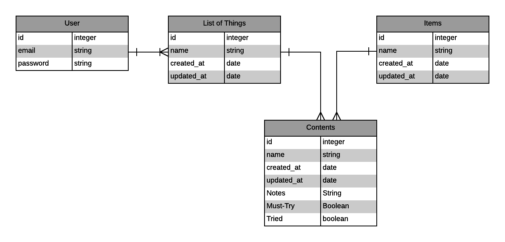

# Keepr API

A back-end client built using Rails and PostgreSQL for [Keepr](https://github.com/tuckyeah/keepr-ember), a list app for keeping track
of all the things you want to try. Includes Authentication.

API is hosted on Heroku at https://cryptic-fjord-23153.herokuapp.com/

** ERD **

  *Please note: 'Must-Try' Attribute has not yet been added to 'Category_Contents.' It will be added soon.*

### Authentication

| Verb   | URI Pattern            | Controller#Action |
|--------|------------------------|-------------------|
| [POST](#post-sign-up)   | `/sign-up`             | `users#signup`    |
| [POST](#post-sign-in)   | `/sign-in`             | `users#signin`    |
| [PATCH](#patch-change-passwordid)  | `/change-password/:id` | `users#changepw`  |
| [DELETE](#delete-sign-outid) | `/sign-out/:id`        | `users#signout`   |

### Categories

** Please Note: Users are only permitted to access and modify their _own_ categories. **

| Verb   | URI Pattern | Controller#Action |
|--------|-------------|-------------------|
| [GET](#get-categories)    | `/categories`    | `categories#index`     |
| [GET](#get-categories1)    | `/categories/1`  | `categories#show`      |
| [POST](#post-categories)   | `/categories`    | `categories#create`    |
| [PATCH](#patch-categories1)  | `/categories/1`  | `categories#update`    |
| [DELETE](#delete-categories1) | `/categories/1`  | `categories#destroy`   |

### Things
| Verb   | URI Pattern | Controller#Action |
|--------|-------------|-------------------|
| [GET](#get-things)    | `/categories/1/things`    | `things#index`     |
| [GET](#get-things1)    | `/things/1`  | `things#show`      |
| [POST](#post-things)   | `/categories/1/things`    | `things#create`    |

### Category Contents
*(Join Table between Things and Categories)*

** Please Note: Users are only permitted to access and modify their _own_ categories' contents. **

| Verb   | URI Pattern | Controller#Action |
|--------|-------------|-------------------|
| [GET](#get-category_contents1)    | `/category_contents/1`  | `category_contents#show`      |
| [POST](#post-category_contents)   | `/category_contents`    | `category_contents#create`    |
| [PATCH](#patch-category_contents1)  | `/category_contents/1`  | `category_contents#update`    |
| [DELETE](#delete-category_contents1) | `/category_contents/1`  | `category_contents#destroy`   |
